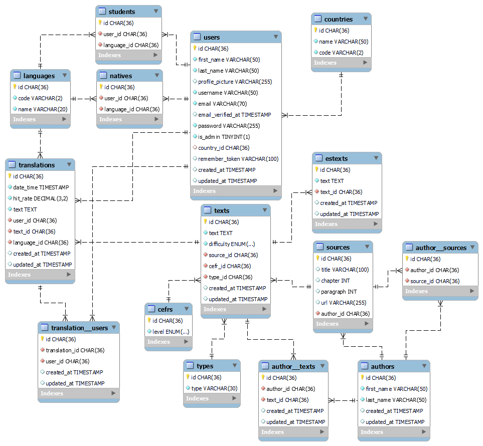

# Languages web application backend

   

Complete backend for the development of a languages web application. Frontend developed with React:

- https://github.com/angelgr-com/nau-frontend

The objective is to develop with the PHP Laravel Framework a REST API (an Application Programming Interface following the design principles of the REST, or representational state transfer architectural style).

## Table of contents

  - [Application requirements](#application-requirements)
  - [Technologies](#technologies)
  - [Database model](#database-model)
  - [How to use](#how-to-use)
    - [Online](#online)
    - [Local](#local)
  - [API endpoints](#api-endpoints)

## Application requirements

- 🆗 Users must be able to register to the application, by establishing a username/password.
- ✅ Users must be able to authenticate themselves to the application by logging in.
- 🆕 Users have to be able to translate texts from English to Spanish or vice versa and receive their hit rate.
- 👩‍💻 Users must be able find details about the text they are translating, by finding its CEFR level, difficulty and type.
- 📋 Users can enter and modify their profile data.
- 🆑 Users must be able to delete their profile data.
- 👋 Users must be able to log out of the web application.

## Technologies

Technologies used for the development of the API:

- **Laravel**. A MVC PHP framework. 
- **Laravel/Passport** for API authentication using JWT (JSON Web Token).
- **SQL**:
  - **Eloquent**, an object-relational mapper (ORM) to interact with the database.
  - **Laravel's database Query Builder**, an interface to creating and running database queries.
- **Git-Flow**, used to code by creating a branch for each feature.
- **Heroku** to upload the app to production.

## Database model

The database uses several tables to store the application information.

The main ones are **users **and **texts **which are related through the **translations **table.



## How to use

### Online

The API is deployed in Heroku so to test the endpoints it is only necessary to use a tool like [Postman](https://www.postman.com/), [Thunder](https://www.thunderclient.com/) or [Insomnia](https://insomnia.rest/).

By downloading the following files, it is possible to import the endpoints into Postman with a set of requests ready to test endpoints:

- Users:
  - a1_lan-api_users.postman_collection.json
- Texts:
  - a2_lan-api_texts.postman_collection.json

### Local

- Clone or [download](https://github.com/angelgr-com/lan-api/archive/refs/heads/main.zip) this repository.

- With [PHP](https://www.php.net/manual/en/install.php) and [Composer](https://getcomposer.org/download/) installed, it is possible to install [Laravel](https://laravel.com/docs/9.x/installation) by using Composer:

  ```bash
  composer global require laravel/installer
  ```

- Open the repository folder and install dependencies:

  ```bash
  cd lan-api
  composer install
  ```

- Create a new empty local schema.

- Create a .env file and enter the database configuration using environment variables:

  ```bash
  DB_CONNECTION=mysql
  DB_HOST=
  DB_PORT=
  DB_DATABASE=
  DB_USERNAME=
  DB_PASSWORD=
  ```

- Run database migrations and seeders:

  ```bash
  php artisan migrate:fresh --seed
  ```

- Generate passport keys:

  ```bash
  php artisan passport:keys
  ```

- Store the keys in the .env file:

  ```
  PASSPORT_PERSONAL_ACCESS_CLIENT_ID=
  PASSPORT_PERSONAL_ACCESS_CLIENT_SECRET=
  ```
  
- Start the server:

  ```
  php artisan serve
  ```

## API endpoints

- Base URL:
  - https://quiet-shelf-00426.herokuapp.com/api/

- Users:

  | method | path                   | comments                                            |
  | ------ | ---------------------- | --------------------------------------------------- |
  | POST   | users/register         |                                                     |
  | POST   | users/login            |                                                     |
  | POST   | users/logout           | Token required                                      |
  | GET    | users/profile          | Token required                                      |
  | PUT    | users/profile          | Token required. Edit profile.                       |
  | POST   | users/delete           | Token required. Delete profile.                     |
  | POST   | users/profile/add-data | Token required. Add data to user profile.           |
  | GET    | users/profile/complete | Token required. Checks if user profile is complete. |

- Texts:

  | method | path                 | description                                                  |
  | ------ | -------------------- | ------------------------------------------------------------ |
  | GET    | texts/               | Token required. Retrieve a list of all texts.                |
  | GET    | texts/id/{id}        | Token required. Get a text by ID.                            |
  | GET    | texts/cefr/{cefr}    | Token required. Get texts by their CEFR level (A1, A2, B1, B2, C1 or C2). |
  | GET    | texts/en-es/{textId} | Token required. Obtains the corresponding translation stored in database. |
  | POST   | texts/translation    | Token required. Saves the user's translation in the database facilitating the translation hit rate. |
  | GET    | texts/author/{id}    | Token required. Gets the full name of an author.             |
  | GET    | texts/languages      | Token required. Provides a list of languages.                |
  | GET    | texts/countries      | Token required. Provides a list of languages.                |
  | GET    | texts/zenquotes      | Token required. Provides a list of quotes from the zenquotes API. |

  